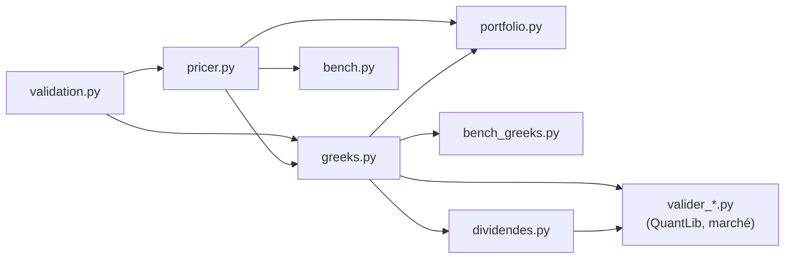

# options_pricing

**Pricing et sensibilités (Grecques) d'options financières en Python, optimisés CPU.**

Options européennes, asiatiques et américaines dans le modèle de Black–Scholes :
formules fermées, Monte Carlo avec réduction de variance, quasi-Monte Carlo,
Longstaff–Schwartz et arbre binomial. Le code est vectorisé avec NumPy,
compilé et parallélisé avec Numba, validé par des tests et comparé à QuantLib.

Les méthodes suivent G. Pagès, *Numerical Probability: An Introduction with
Applications to Finance* (Springer, Universitext, 2018).


---

## Sommaire

- [Fonctionnalités](#fonctionnalités)
- [Résultats](#résultats)
- [Structure du projet](#structure-du-projet)
- [Installation](#installation)
- [Démarrage rapide](#démarrage-rapide)
- [Méthodes numériques](#méthodes-numériques)
- [Les Grecques et leurs conventions](#les-grecques-et-leurs-conventions)
- [Optimisation CPU](#optimisation-cpu)
- [Gestion des erreurs](#gestion-des-erreurs)
- [Tests](#tests)
- [Validation externe (QuantLib, données de marché)](#validation-externe-quantlib-données-de-marché)
- [Limites connues](#limites-connues)
- [Références](#références)

---

## Fonctionnalités

| Option | Prix | Grecques (Δ, Γ, Véga, ρ, Θ) |
|---|---|---|
| **Européenne** | Formule fermée, Monte Carlo (antithétique + variable de contrôle), quasi-Monte Carlo (Sobol brouillé) | Formules fermées, Monte Carlo pathwise / rapport de vraisemblance |
| **Asiatique arithmétique** | Monte Carlo Numba + variable de contrôle géométrique | Pathwise / rapport de vraisemblance, avec variable de contrôle sur chaque Grecque |
| **Asiatique géométrique** | Formule fermée | Dérivées de la formule fermée |
| **Américaine** | Longstaff–Schwartz (Numba), arbre binomial CRR | Différences finies à nombres aléatoires communs, arbre CRR |
| **Américaine avec dividendes discrets** | Arbre CRR, modèles « spot » et « escrowed » (`dividendes.py`) | Arbre CRR |

Et aussi :

- **Intervalle de confiance à 95 %** sur chaque estimation Monte Carlo (`MCResult`).
- **Conventions de marché** : Thêta par jour, Véga et Rho pour 1 point (`market_units`).
- **Pricing de portefeuille** : isolation des trades invalides, rapport des rejets, Grecques agrégées.
- **Validation stricte** des entrées et **contrôle des sorties** (aucun NaN, bornes de non-arbitrage).
- **Validation externe** contre QuantLib et sur de vraies chaînes d'options.

---

## Résultats

Les chiffres ci-dessous sont mesurés sur un call S = K = 100, r = 5 %, σ = 20 %, T = 1 an
(machine Linux, 2 cœurs). Ils sont indicatifs ; relancez `bench.py` et `bench_greeks.py`
pour les obtenir sur votre machine.

### Réduction de variance : la meilleure optimisation CPU

L'erreur Monte Carlo décroît en σ/√N : diviser l'écart-type par 10 revient à diviser
par 100 le nombre de simulations nécessaires.

| Méthode (≈ 2 M de tirages) | Temps | Prix ± demi-largeur IC 95 % |
|---|---|---|
| Monte Carlo brut | 0,064 s | 10,4556 ± 0,0204 |
| + antithétique + variable de contrôle | 0,047 s | 10,4480 ± 0,0038 |
| Quasi-Monte Carlo (Sobol brouillé) | 0,091 s | **10,45055 ± 0,00006** |
| *Formule fermée* | | *10,45058* |

Pour l'asiatique arithmétique (52 dates), la variable de contrôle géométrique réduit
l'intervalle de confiance d'un facteur 36 (± 0,022 → ± 0,0006) pour le même temps de calcul.

### Grecques Monte Carlo contre formules exactes

Une seule simulation donne le prix **et** les 5 Grecques (2 M de trajectoires, 0,14 s) :

| Grecque | Monte Carlo ± IC 95 % | Exact |
|---|---|---|
| Delta | 0,63697 ± 0,00028 | 0,63683 |
| Gamma | 0,01874 ± 0,00005 | 0,01876 |
| Véga | 37,486 ± 0,091 | 37,524 |
| Rho | 53,251 ± 0,030 | 53,232 |
| Thêta (par an) | −6,411 ± 0,009 | −6,414 |

### Put américain

| Méthode | Prix |
|---|---|
| Longstaff–Schwartz, 200 000 trajectoires × 50 dates (0,28 s) | 6,0803 ± 0,0316 |
| Arbre CRR, 2 000 pas | 6,0900 |
| *Put européen (borne basse)* | *5,5735* |

---

## Structure du projet

```
options_pricing/
├── pricer.py              Prix : Black–Scholes, MC, QMC, asiatique, américaine (LSM)
├── greeks.py              Grecques : formules fermées, pathwise, LR, différences finies, CRR
├── validation.py          Exceptions métier, contrôles des entrées et des sorties
├── portfolio.py           Pricing d'un portefeuille, rapport des trades rejetés
├── bench.py               Benchmark des prix
├── bench_greeks.py        Benchmark des Grecques
├── dividendes.py          Arbre CRR américain avec dividendes discrets
├── adaptateur_crr.py      Adaptateur de crr_american pour valider_pricer.py
├── valider_pricer.py      crr_american vs QuantLib
├── valider_lsm.py         Longstaff–Schwartz vs QuantLib
├── valider_dividendes.py  crr_american_div vs QuantLib
├── valider_marche.py      Test sur une vraie chaîne d'options
├── generer_chaine_test.py Chaîne synthétique pour tester hors ligne
├── pyproject.toml         Configuration du projet et de pytest
└── tests/
    ├── conftest.py
    ├── test_closed_form.py   Formules fermées, parités, EDP de Black–Scholes
    ├── test_monte_carlo.py   Estimateurs MC, réduction de variance, LSM
    ├── test_greeks_mc.py     Grecques MC, différences finies, arbre CRR
    ├── test_validation.py    Entrées invalides, contrôle des sorties
    └── test_portfolio.py     Isolation des erreurs, rapport, agrégation
```



Chaque fichier `.py` peut aussi être lancé directement (bouton ▶ de VS Code ou
`python fichier.py`) : `pricer.py`, `greeks.py` et `portfolio.py` affichent une
démonstration, et chaque fichier de test lance ses propres tests.

---

## Installation

Python 3.10 ou plus récent.

```bash
git clone https://github.com/<votre-compte>/options_pricing.git
cd options_pricing
python -m pip install numpy scipy numba pytest pytest-cov hypothesis
```

Pour la validation externe (facultatif) :

```bash
python -m pip install QuantLib pandas matplotlib yfinance
```

> Sous Windows, utilisez le même interpréteur pour installer et pour lancer
> (par exemple `python3.13 -m pip ...` puis `python3.13 -m pytest`).

---

## Démarrage rapide

### Prix

```python
from pricer import BlackScholes, bs_price, mc_european, mc_asian_arithmetic, lsm_american_put

m = BlackScholes(s0=100, r=0.05, sigma=0.2)          # q (dividende continu) = 0 par défaut

print(bs_price(m, K=100, T=1))                       # 10.4506  (formule fermée)
print(mc_european(m, K=100, T=1))                    # 10.447964 ± 0.003823  (IC95 [...], N=2,000,000)
print(mc_asian_arithmetic(m, K=100, T=1, n_steps=52))
print(lsm_american_put(m, K=100, T=1))
```

`bs_price` et `bs_greeks` sont vectorisés : on peut passer un tableau de strikes
ou de maturités.

```python
import numpy as np
prix = bs_price(m, K=np.linspace(80, 120, 41), T=1)   # 41 prix en un appel
```

### Grecques

```python
from greeks import bs_greeks, mc_european_greeks, mc_asian_greeks, crr_american, market_units

exact = bs_greeks(m, K=100, T=1)                      # formules fermées
mc    = mc_european_greeks(m, K=100, T=1)             # Monte Carlo, avec IC
print(mc["delta"])                                    # 0.636969 ± 0.000282  (IC95 [...], N=2,000,000)

asian = mc_asian_greeks(m, K=100, T=1, n_steps=52)    # asiatique
amer  = crr_american(m, K=100, T=1, kind="put")       # américaine

# Conventions de marché : Thêta par jour, Véga et Rho pour 1 point
print(market_units(exact))
# ≈ {'price': 10.45, 'delta': 0.6368, 'gamma': 0.0188, 'vega': 0.3752, 'rho': 0.5323, 'theta': -0.0176}
```

### Portefeuille

```python
from portfolio import Trade, price_portfolio

book = [
    Trade("EU-001", "european", "call", 100, 1.0, quantity=10),
    Trade("AS-001", "asian",    "call", 100, 1.0, quantity=20, n_fixings=12),
    Trade("AM-001", "american", "put",  105, 2.0, quantity=8),
    Trade("BAD-01", "european", "call", -100, 1.0),           # strike invalide
]
report = price_portfolio(m, book)
print(report.summary())       # 3 trades pricés, 1 rejeté, TOTAL* marqué partiel
if not report.complete:
    ...                       # alerter : des trades manquent dans les totaux
```

### Benchmarks et démonstrations

```bash
python bench.py           # prix : Python pur vs NumPy vs Numba, réduction de variance
python bench_greeks.py    # Grecques : MC vs formules fermées, asiatique, américaine
python portfolio.py       # portefeuille avec trades invalides
```

---

## Méthodes numériques

| Méthode | Fonction | Pagès, chapitre |
|---|---|---|
| Simulation exacte de S_T (sans biais de discrétisation) | `mc_european` | 2 |
| Intervalle de confiance, erreur standard en ligne par blocs | `MCResult`, `_RunningStats` | 2.1 |
| Variables antithétiques | `mc_european`, `mc_european_greeks` | 3.1.2 |
| Variable de contrôle à β optimal (bloc pilote indépendant) | `mc_european`, `mc_asian_arithmetic`, `mc_asian_greeks` | 3.2 |
| Quasi-Monte Carlo randomisé (Sobol brouillé, réplications indépendantes) | `rqmc_european` | 4.4 |
| Asiatique : contrôle par l'asiatique géométrique (formule fermée) | `mc_asian_arithmetic` | 3, 8 |
| Grecques pathwise (processus tangent) | `mc_european_greeks`, `mc_asian_greeks` | 2.2.4, 10 |
| Gamma : estimateur mixte pathwise / rapport de vraisemblance | idem | 2.2.3, 10 |
| Différences finies à nombres aléatoires communs | `fd_greeks_crn` | 10 |
| Longstaff–Schwartz (régression polynomiale, équations normales) | `lsm_american_put` | 12 |
| Arbre binomial de Cox–Ross–Rubinstein | `crr_american` | 12 |

**Pourquoi un estimateur mixte pour le Gamma ?** Le Delta pathwise d'un call,
e^{−rT} 1{S_T > K} S_T / S_0, est discontinu en K : on ne peut pas le dériver une
seconde fois trajectoire par trajectoire. On applique donc le rapport de
vraisemblance au Delta pathwise, ce qui revient à le pondérer par
Z/(σ√T) − 1.

**Pourquoi des nombres aléatoires communs ?** Une différence finie
(V(S+h) − V(S−h)) / 2h calculée avec deux simulations indépendantes est noyée dans
le bruit Monte Carlo. Avec la même graine pour les deux prix, le bruit se compense :
les tests montrent une erreur sur le Gamma au moins 10 fois plus petite.

---

## Les Grecques et leurs conventions

| Grecque | Ordre | Mesure | Unité mathématique (fonctions) | Convention de marché (`market_units`) |
|---|---|---|---|---|
| Delta (Δ) | 1 | ∂V/∂S | € par 1 € de sous-jacent | identique |
| Gamma (Γ) | 2 | ∂²V/∂S² | variation du Delta par 1 € | identique |
| Véga (𝒱) | 1 | ∂V/∂σ | € pour +100 points de vol | € pour +1 point (20 % → 21 %) |
| Rho (ρ) | 1 | ∂V/∂r | € pour +100 points de taux | € pour +1 point (3 % → 4 %) |
| Thêta (Θ) | 1 | −∂V/∂T | € par an | € par jour (365 ou 252) |

```python
market_units(bs_greeks(m, 100, 1))        # Thêta par jour calendaire
market_units(bs_greeks(m, 100, 1), 252)   # Thêta par jour ouvré
```

À garder en tête :

- Le Delta va de 0 à 1 pour un call et de −1 à 0 pour un put.
- « 1 % de volatilité » signifie **1 point** (20 % → 21 %), pas 1 % de 20 %.
- Les Grecques sont des **approximations linéaires** : pour un put à 2 ans, la vraie
  variation pour +1 point de taux (−1,461 €) s'écarte de 2,2 % de Rho/100 (−1,493 €).

---

## Optimisation CPU

| Technique | Où | Effet |
|---|---|---|
| Réduction de variance | `mc_european`, asiatique | jusqu'à ×36 sur l'intervalle de confiance à temps égal |
| Une simulation pour prix + 5 Grecques | `mc_european_greeks`, `mc_asian_greeks` | évite 9 re-calculs de prix par différences finies |
| Vectorisation NumPy | partout | aucune boucle Python sur les trajectoires |
| Noyaux Numba `@njit(parallel=True)` | asiatique, Grecques asiatiques, LSM | code machine multi-cœur ; LSM 3,4 fois plus rapide qu'en NumPy |
| Calcul par blocs + statistiques en ligne | `mc_european`, asiatique | mémoire bornée, données dans le cache CPU |
| LSM : chemins calculés en place, régression par équations normales | `_lsm_kernel` | mémoire divisée par 2, pas de SVD à chaque date |
| Générateur PCG64 + `SeedSequence` | partout | résultats reproductibles, découpage propre entre processus |

Le premier appel d'une fonction Numba la compile (quelques secondes) ; le code
compilé est ensuite mis en cache sur disque.

---

## Gestion des erreurs

Le principe : **un prix faux renvoyé en silence est plus dangereux qu'une erreur.**

- **Le moteur** (`pricer.py`, `greeks.py`) valide chaque entrée et lève une erreur
  claire. Il ne contient aucun `try/except`.
- **Les sorties** sont contrôlées : prix et Grecques finis, prix dans les bornes de
  non-arbitrage.
- **La frontière** (`portfolio.py`) contient les `try/except` : chaque trade est
  isolé, chaque rejet est journalisé, et les totaux sont marqués **partiels** si un
  trade manque.

```
PricingError (hérite de ValueError)
├── InvalidInputError   paramètre invalide
└── NumericalError      résultat non fini ou hors bornes
```

| Entrée | Comportement |
|---|---|
| `kind="Call"`, `" PUT "` | accepté (insensible à la casse et aux espaces) |
| `kind="achat"` | `InvalidInputError` |
| strike ou maturité ≤ 0, NaN, infini, texte | `InvalidInputError` qui nomme le paramètre |
| `sigma=20` au lieu de `0.20` | `InvalidInputError` : « probablement exprimée en % » |
| `n_paths=0`, `degree=12`, … | `InvalidInputError` |
| LSM demandant plus de 4 Go de mémoire | refusé avant de commencer |
| taux ou dividende négatifs | acceptés (cas réels) |

---

## Tests

```bash
python -m pytest                   # tous les tests
python -m pytest -m "not slow"     # sans les 2 tests Monte Carlo lourds
python -m pytest tests/test_validation.py -v
```

Couverture de code (désactiver Numba pour que l'outil voie l'intérieur des noyaux) :

```bash
# Linux / macOS
NUMBA_DISABLE_JIT=1 python -m pytest --cov=pricer --cov=greeks --cov=validation --cov=portfolio --cov-report=term-missing
# Windows PowerShell
$env:NUMBA_DISABLE_JIT=1; python -m pytest --cov=pricer --cov=greeks --cov=validation --cov=portfolio --cov-report=term-missing
```

La suite contient 335 tests pour les modules de base (`pricer`, `greeks`, `validation`,
`portfolio`). Ce qu'ils vérifient :

- **Formules fermées** : valeurs de référence, parité call-put, bornes de non-arbitrage,
  **équation aux dérivées partielles de Black–Scholes** (Θ + ½σ²S²Γ + (r−q)SΔ − rV = 0),
  chaque Grecque contre une dérivée numérique ; propriétés testées sur des centaines
  de paramètres aléatoires avec Hypothesis.
- **Monte Carlo** : absence de biais pour chaque combinaison de réduction de variance,
  erreur standard en 1/√N, **couverture réelle de l'IC à 95 %** sur 100 graines,
  reproductibilité.
- **Grecques** : chaque estimateur MC contre la formule exacte ; Delta, Véga et Thêta
  pathwise contre une dérivée numérique **trajectoire par trajectoire** ; présence des
  5 Grecques dans chaque fonction.
- **Américaine** : LSM contre l'arbre CRR, convergence de l'arbre, call américain sans
  dividende égal à l'européen.
- **Erreurs** : chaque fonction publique croisée avec chaque entrée invalide ; bug
  numérique simulé (noyau renvoyant NaN) bloqué en sortie ; isolation des trades,
  journalisation, Ctrl+C toujours actif.

Les tests Monte Carlo utilisent des **graines fixes** : ils donnent toujours le même
résultat. Une estimation est acceptée si l'écart à la référence est inférieur à
4 erreurs standard.

---

## Validation externe (QuantLib, données de marché)

| Fichier | Rôle |
|---|---|
| `dividendes.py` | Arbre CRR américain avec dividendes discrets (modèles « spot » et « escrowed ») |
| `valider_pricer.py` + `adaptateur_crr.py` | Prix et Grecques de `crr_american` vs QuantLib, propriétés théoriques |
| `valider_lsm.py` | Put Longstaff–Schwartz vs QuantLib (biais, convergence, graines) |
| `valider_dividendes.py` | `crr_american_div` vs QuantLib, prix et Grecques, deux modèles |
| `valider_marche.py` | Test sur une vraie chaîne d'options (Yahoo Finance ou CSV) |
| `generer_chaine_test.py` | Chaîne synthétique pour tester `valider_marche.py` hors ligne |

```bash
python -m pip install QuantLib pandas matplotlib yfinance

python valider_pricer.py --module adaptateur_crr
python valider_lsm.py
python valider_dividendes.py
python valider_marche.py --ticker AAPL --taux 0.04      # taux sans risque du jour à renseigner
```

Pour tester `valider_marche.py` sans connexion, générez d'abord une chaîne
synthétique avec `generer_chaine_test.py`.

> Le taux passé à `--taux` doit être le taux sans risque du jour, pour la maturité
> des options testées ; une valeur périmée biaise la comparaison.

---

## Limites connues

- **Modèle de Black–Scholes uniquement** : volatilité et taux constants, pas de smile
  de volatilité, de volatilité locale ou stochastique.
- **Longstaff–Schwartz** donne une borne **inférieure** du prix (biais bas lié à la
  politique d'exercice estimée) ; le Gamma par différences finies y est bruité
  (0,0217 contre 0,0230 pour l'arbre). Pour l'américaine vanille, l'arbre CRR est
  plus précis.
- **Thêta de l'asiatique** : les dates de constatation restent régulièrement
  réparties jusqu'à l'échéance quand T varie (même convention que les différences
  finies).
- **Asiatique géométrique** utilisée comme variable de contrôle : sa formule fermée
  suppose des dates régulières iT/n.
- **Gamma de l'asiatique** : l'estimateur par rapport de vraisemblance porte sur le
  premier pas de temps, sa variance augmente avec le nombre de dates (compensé ici
  par la variable de contrôle).

---

## Références

- G. Pagès, *Numerical Probability: An Introduction with Applications to Finance*,
  Universitext, Springer, 2018. doi:10.1007/978-3-319-90276-0
- F. Longstaff, E. Schwartz, « Valuing American Options by Simulation: A Simple
  Least-Squares Approach », *Review of Financial Studies*, 14(1), 2001.
- J. Cox, S. Ross, M. Rubinstein, « Option Pricing: A Simplified Approach »,
  *Journal of Financial Economics*, 7(3), 1979.
- A. Kemna, A. Vorst, « A Pricing Method for Options Based on Average Asset Values »,
  *Journal of Banking & Finance*, 14(1), 1990.
- P. Glasserman, *Monte Carlo Methods in Financial Engineering*, Springer, 2003.
- J. Hull, *Options, Futures, and Other Derivatives*, Pearson.

---

## Auteur

Matthieu Briche
