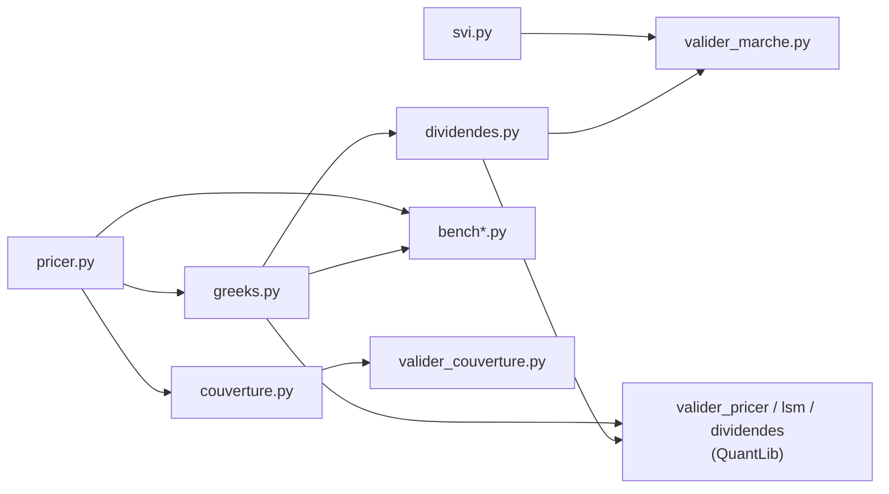

# options-pricing

🇬🇧 English · [🇫🇷 Version française](README.fr.md)

**Option pricing, Greeks and hedging in Python, CPU-optimised and validated against QuantLib and market data.**

European, Asian and American options (with discrete dividends): closed-form formulas,
Monte Carlo with variance reduction, quasi-Monte Carlo, Longstaff–Schwartz and binomial
tree. Arbitrage-free SVI smile calibration on real option chains, and backtesting of
hedging strategies. Code vectorised with NumPy, compiled and parallelised with Numba.

The numerical methods follow G. Pagès, *Numerical Probability* (Springer, 2018);
the hedging part follows Bouchard & Chassagneux, *Fundamentals and Advanced
Techniques in Derivatives Hedging* (Springer, 2016).


---

## Contents

- [At a glance](#at-a-glance)
- [Features](#features)
- [Results](#results)
- [Project structure](#project-structure)
- [Installation](#installation)
- [Quick start](#quick-start)
- [Numerical methods](#numerical-methods)
- [Tests](#tests)
- [External validation](#external-validation)
- [Known limitations](#known-limitations)
- [References](#references)

---

## At a glance

| | |
|---|---|
| European call, quasi-Monte Carlo | 10.45055 ± 0.00006 vs. an exact value of 10.45058 |
| Price + 5 Greeks from a **single** simulation | 2M paths, error vs. closed form < 0.1% |
| Real AAPL option chain, American pricer + SVI smile | **94.3%** of options repriced within the bid-ask spread |
| Hedging, unknown realised vol between 15% and 25% | P&L standard deviation divided by 8 (17% → 2% of the premium) with a gamma-neutral hedge |
| Test suite | 233 pytest tests, including property-based tests with Hypothesis |

---

## Features

| Option | Price | Greeks (Δ, Γ, Vega, ρ, Θ) |
|---|---|---|
| **European** | Closed form, Monte Carlo (antithetic + control variate), quasi-Monte Carlo (scrambled Sobol) | Closed form; Monte Carlo pathwise and likelihood ratio |
| **Arithmetic Asian** | Numba Monte Carlo + geometric control variate | Pathwise / likelihood ratio, with control variate |
| **Geometric Asian** | Closed form | Derivatives of the closed form |
| **American** | Longstaff–Schwartz (Numba), CRR binomial tree | CRR tree; finite differences with common random numbers |
| **American with discrete dividends** | CRR tree, "spot" and "escrowed" models | CRR tree |

Also included:

- **95% confidence interval** on every Monte Carlo estimate (`MCResult`).
- **SVI volatility smile** (Gatheral) with no-arbitrage checks:
  butterfly (Durrleman condition), calendar, Roger Lee bound on the wings.
- **Market data validation**: quote cleaning, implied borrow cost calibrated per
  expiry, implied vol inversion, repricing within the bid-ask spread.
- **Hedging backtest**: discrete delta hedging, misspecified vol, uncertain vol
  (Black–Scholes–Barenblatt), gamma-neutral hedging, P&L CVaR.

---

## Results

Measured on a call with S = K = 100, r = 5%, σ = 20%, T = 1 year (Linux, 2 cores).
Timings are indicative: rerun `bench.py` and `bench_greeks.py` on your own machine.

### Variance reduction

Monte Carlo error decreases as σ/√N: dividing the standard deviation by 10 is
equivalent to dividing the number of simulations needed by 100.

| Method (≈ 2M draws) | Time | Price ± 95% CI half-width |
|---|---|---|
| Plain Monte Carlo | 0.064 s | 10.4556 ± 0.0204 |
| + antithetic + control variate | 0.047 s | 10.4480 ± 0.0038 |
| Quasi-Monte Carlo (scrambled Sobol) | 0.091 s | **10.45055 ± 0.00006** |
| *Closed form* | | *10.45058* |

For the arithmetic Asian option (52 dates), the geometric control variate shrinks
the confidence interval by a factor of 36 (± 0.022 → ± 0.0006) at equal computing time.

### Monte Carlo Greeks vs. exact formulas

A single simulation yields the price **and** all 5 Greeks (2M paths):

| Greek | Monte Carlo ± 95% CI | Exact |
|---|---|---|
| Delta | 0.63697 ± 0.00028 | 0.63683 |
| Gamma | 0.01874 ± 0.00005 | 0.01876 |
| Vega | 37.486 ± 0.091 | 37.524 |
| Rho | 53.251 ± 0.030 | 53.232 |
| Theta (per year) | −6.411 ± 0.009 | −6.414 |

### American put

| Method | Price |
|---|---|
| Longstaff–Schwartz, 200,000 paths × 50 dates | 6.0803 ± 0.0316 |
| CRR tree, 2,000 steps | 6.0900 |
| *European put (lower bound)* | *5.5735* |

### Volatility smile on market data

`valider_marche.py` inverts the American pricer (discrete dividends) on every quote,
fits an SVI smile per expiry and measures the share of options repriced within the
bid-ask spread.

- **Synthetic chain** priced by QuantLib (independent engine), 6 expiries from 17 to
  290 days: **100%** of the 322 retained options repriced within the spread, median
  smile − market gap of 0.04 vol points, borrow cost recovered (0.30% target,
  0.21% to 0.39% fitted depending on expiry), no butterfly or calendar arbitrage.
- **Real AAPL chain** (Yahoo Finance, delayed data, 7 October 2026 during market hours):
  **94.3%** of the 350 retained options repriced within the spread, across 6 expiries
  from 7 days to 14 months; median smile − market gap of 0.15 vol points, median
  call/put vol gap at the same strike of 0.94 points, no butterfly or calendar arbitrage.


### Hedging

6-month ATM call sold at the Black–Scholes price with 20% vol, delta-hedged 52 times.
The realised vol is unknown, drawn uniformly between 15% and 25% on each path
(100,000 paths):

| Strategy | Mean P&L | P&L std. dev. | 5% CVaR |
|---|---|---|---|
| Delta only | +0.004 ± 0.010 | 1.091 (**17.1%** of the premium) | −2.57 |
| Delta + gamma-neutral (second option) | +0.000 ± 0.001 | 0.136 (**2.1%** of the premium) | −0.29 |

The script also checks the theory point by point: zero mean P&L under the correct
model, standard deviation scaling as 1/√N (measured log-log slope −0.49, 1 to 4% off
the first-order theory), the formula ½ ∫ e^{−rt}(σ̃² − σ²) S² Γ dt for a misspecified
vol, and that hedging at σ_max never loses on average when the vol is uncertain.


---

## Project structure

File names are in French; here is what each one does.

```
options-pricing/
├── pricer.py               Prices: Black–Scholes, MC, QMC, Asian, American (LSM)
├── greeks.py               Greeks: closed form, pathwise, LR, finite differences, CRR
├── dividendes.py           American CRR tree with discrete dividends (spot / escrowed)
├── svi.py                  SVI smile: fitting, butterfly and calendar arbitrage checks
├── couverture.py           Hedging backtest: delta hedging, gamma-neutral, P&L
├── bench.py                Price benchmark
├── bench_greeks.py         Greeks benchmark
├── valider_pricer.py       crr_american vs QuantLib, theoretical properties
├── adaptateur_crr.py       Adapter for crr_american used by valider_pricer.py
├── valider_lsm.py          Longstaff–Schwartz vs QuantLib
├── valider_dividendes.py   crr_american_div vs QuantLib
├── valider_marche.py       Test on a real option chain (Yahoo Finance or CSV)
├── valider_couverture.py   Validation of the hedging backtest against theory
├── generer_chaine_test.py  Synthetic chain (QuantLib) for offline testing
├── docs/                   README charts
├── pyproject.toml          Project and pytest configuration
└── tests/
    ├── conftest.py
    ├── test_closed_form.py     Closed forms, parities, Black–Scholes PDE
    ├── test_monte_carlo.py     MC estimators, variance reduction, LSM
    ├── test_greeks_mc.py       MC Greeks, finite differences, CRR tree
    ├── test_proprietes.py      Arbitrage properties and cross-method consistency
    ├── test_dividendes.py      Discrete-dividend tree vs QuantLib
    ├── test_svi.py             SVI fitting and arbitrage checks
    └── test_valider_marche.py  Time measurement, borrow calibration, implied vols
```



---

## Installation

Python 3.10 or later.

```bash
git clone https://github.com/matthieu-briche/python-options-pricing.git
cd python-options-pricing
python -m pip install numpy scipy numba pytest pytest-cov hypothesis
```

For external validation (optional):

```bash
python -m pip install QuantLib pandas matplotlib yfinance
```

---

## Quick start

### Prices

```python
from pricer import BlackScholes, bs_price, mc_european, rqmc_european, mc_asian_arithmetic, lsm_american_put

m = BlackScholes(s0=100, r=0.05, sigma=0.2)      # continuous dividend q = 0 by default

print(bs_price(m, K=100, T=1))                   # 10.4506  (closed form)
print(mc_european(m, K=100, T=1))                # 10.447964 ± 0.003823  (95% CI [...], N=2,000,000)
print(rqmc_european(m, K=100, T=1))              # 10.450554 ± 0.000055
print(mc_asian_arithmetic(m, K=100, T=1, n_steps=52))
print(lsm_american_put(m, K=100, T=1))           # 6.080280 ± 0.031559
```

`bs_price` is vectorised: you can pass an array of strikes or maturities.

### Greeks

```python
from greeks import bs_greeks, mc_european_greeks, crr_american

exact = bs_greeks(m, K=100, T=1)                 # closed form
mc    = mc_european_greeks(m, K=100, T=1)        # price + 5 Greeks, with CI
print(mc["delta"])                               # 0.636969 ± 0.000282
amer  = crr_american(m, K=100, T=1, kind="put")  # American, CRR tree
```

### American option with discrete dividends

```python
from dividendes import crr_american_div

divs = [(0.25, 1.5), (0.50, 1.5), (0.75, 1.5)]   # (date in years, amount)
print(crr_american_div(m, K=100, T=1, kind="put", dividends=divs, model="escrowed"))
```

### Hedging

```python
import numpy as np
from pricer import BlackScholes
from couverture import simuler_couverture, OptionCouverture

m = BlackScholes(s0=100, r=0.03, sigma=0.20)                 # hedging vol
sigma_reelle = np.random.default_rng(0).uniform(0.15, 0.25, 100_000)   # realised vol per path

delta  = simuler_couverture(m, K=100, T=0.5, n_reb=52, sigma_reelle=sigma_reelle)
gamma0 = simuler_couverture(m, K=100, T=0.5, n_reb=52, sigma_reelle=sigma_reelle,
                            couverture_gamma=OptionCouverture(K=100, T=1.0))
print(delta.resume()["ecart_type_rel"], gamma0.resume()["ecart_type_rel"])   # ≈ 0.17  0.02
```

---

## Numerical methods

| Method | Function | Pagès, chapter |
|---|---|---|
| Exact simulation of S_T (no discretisation bias) | `mc_european` | 2 |
| Confidence interval, online block-wise standard error | `MCResult`, `_RunningStats` | 2.1 |
| Antithetic variates | `mc_european`, `mc_european_greeks` | 3.1.2 |
| Control variate with optimal β | `mc_european`, `mc_asian_arithmetic`, `mc_asian_greeks` | 3.2 |
| Randomised quasi-Monte Carlo (scrambled Sobol) | `rqmc_european` | 4.4 |
| Pathwise Greeks (tangent process) | `mc_european_greeks`, `mc_asian_greeks` | 2.2.4, 10 |
| Gamma: mixed pathwise / likelihood ratio estimator | same | 2.2.3, 10 |
| Finite differences with common random numbers | `fd_greeks_crn` | 10 |
| Longstaff–Schwartz (polynomial regression) | `lsm_american_put` | 12 |
| Cox–Ross–Rubinstein binomial tree | `crr_american`, `crr_american_div` | 12 |

**Why a mixed estimator for Gamma?** The pathwise Delta of a call,
e^{−rT} 1{S_T > K} S_T / S_0, is discontinuous at K: it cannot be differentiated a
second time path by path. The likelihood ratio method is therefore applied to the
pathwise Delta, which amounts to weighting it by Z/(σ√T) − 1.

**Why common random numbers?** A finite difference (V(S+h) − V(S−h)) / 2h computed
with two independent simulations is drowned in Monte Carlo noise. Using the same seed
for both prices makes the noise cancel out.

**Why SVI rather than a polynomial?** Wings linear in variance (consistent with
Roger Lee's theorem), sound extrapolation beyond quoted strikes, interpretable
parameters and verifiable no-arbitrage conditions.

### CPU optimisation

| Technique | Effect |
|---|---|
| Variance reduction | up to ×36 on the confidence interval at equal time |
| One simulation for the price and all 5 Greeks | avoids re-pricing by finite differences |
| NumPy vectorisation | no Python loop over paths |
| Numba `@njit(parallel=True)` kernels | Asian, Asian Greeks, LSM in multi-core machine code |
| Block computation + online statistics | bounded memory, data stays in CPU cache |
| PCG64 generator + `SeedSequence` | reproducible results |

The first call to a Numba function compiles it (a few seconds); the compiled code is
then cached on disk.

---

## Tests

```bash
python -m pytest                   # 233 tests (≈ 1 min)
python -m pytest -m "not slow"     # 220 tests, without the heavy Monte Carlo runs
```

| File | Tests | What is checked |
|---|---|---|
| `test_closed_form.py` | 42 | Reference values, put-call parity, arbitrage bounds, Black–Scholes PDE (Θ + ½σ²S²Γ + (r−q)SΔ − rV = 0) |
| `test_monte_carlo.py` | 31 | Unbiasedness, 1/√N error, actual coverage of the 95% CI, reproducibility |
| `test_greeks_mc.py` | 43 | Each MC estimator vs. the exact formula, finite differences, CRR tree |
| `test_proprietes.py` | 59 | Properties holding for any parameter set (Hypothesis): monotonicity, convexity in strike, bounds, tree convergence |
| `test_dividendes.py` | 13 | Discrete-dividend tree vs. QuantLib reference values |
| `test_svi.py` | 18 | SVI fitting, butterfly and calendar conditions |
| `test_valider_marche.py` | 27 | Time measurement (time zone, ACT/365), borrow calibration, vol inversion |

Monte Carlo tests use **fixed seeds**: an estimate passes if its distance to the
reference is less than 4 standard errors.

---

## External validation

```bash
python valider_pricer.py --module adaptateur_crr     # CRR tree vs QuantLib
python valider_lsm.py                                # Longstaff–Schwartz vs QuantLib
python valider_dividendes.py                         # discrete dividends vs QuantLib
python valider_couverture.py                         # hedging vs theory (≈ 20 s)

# Real chain (Yahoo Finance, delayed data)
python valider_marche.py --ticker AAPL --taux 0.04   # set today's risk-free rate

# Offline: synthetic chain priced by QuantLib
python generer_chaine_test.py
python valider_marche.py --chaine chaine_test.csv --dividendes dividendes_test.csv \
                         --spot 227.5 --date 2026-10-06 --taux 0.04
```

Output files (`rapport_*.csv`, `resultats_marche_*.csv`, `smiles_*.png`…) can be
regenerated and are not version-controlled.

---

## Known limitations

- **Black–Scholes pricer**: constant volatility and rates. The SVI smile is used for
  market validation (implied vol per strike); there is no local or stochastic
  volatility in the pricer.
- **Longstaff–Schwartz** gives a **lower** bound on the price (estimated exercise
  policy); for vanilla American options, the CRR tree is more accurate.
- **Time measurement** in `valider_marche.py`: ACT/365 to the second, without an
  exchange calendar (weekends, holidays); AM-settled index options are out of scope.
- **Hedging**: no transaction costs or market impact.

---

## References

- G. Pagès, *Numerical Probability: An Introduction with Applications to Finance*,
  Universitext, Springer, 2018.
- B. Bouchard, J.-F. Chassagneux, *Fundamentals and Advanced Techniques in Derivatives
  Hedging*, Universitext, Springer, 2016.
- J. Gatheral, "A parsimonious arbitrage-free implied volatility parameterization",
  Global Derivatives, 2004.
- R. Lee, "The Moment Formula for Implied Volatility at Extreme Strikes",
  *Mathematical Finance*, 14(3), 2004.
- F. Longstaff, E. Schwartz, "Valuing American Options by Simulation: A Simple
  Least-Squares Approach", *Review of Financial Studies*, 14(1), 2001.
- J. Cox, S. Ross, M. Rubinstein, "Option Pricing: A Simplified Approach",
  *Journal of Financial Economics*, 7(3), 1979.
- P. Glasserman, *Monte Carlo Methods in Financial Engineering*, Springer, 2003.

---

## Author

Matthieu Briche · [LinkedIn](https://www.linkedin.com/in/matthieu-briche-aa69b441/)

<p align="center">
  <a href="https://github.com/matthieu-briche">
    
  </a>
</p>
