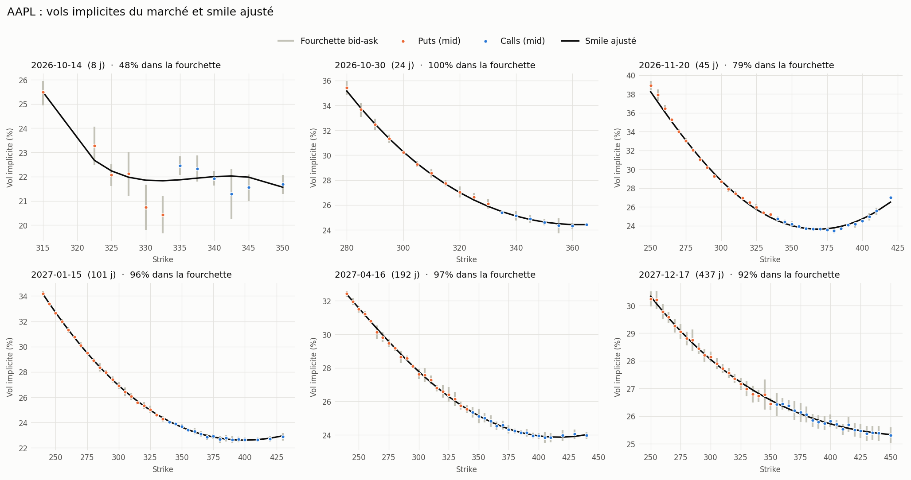
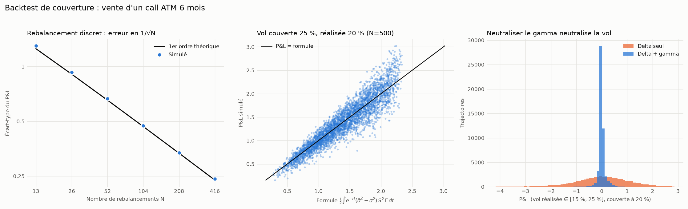
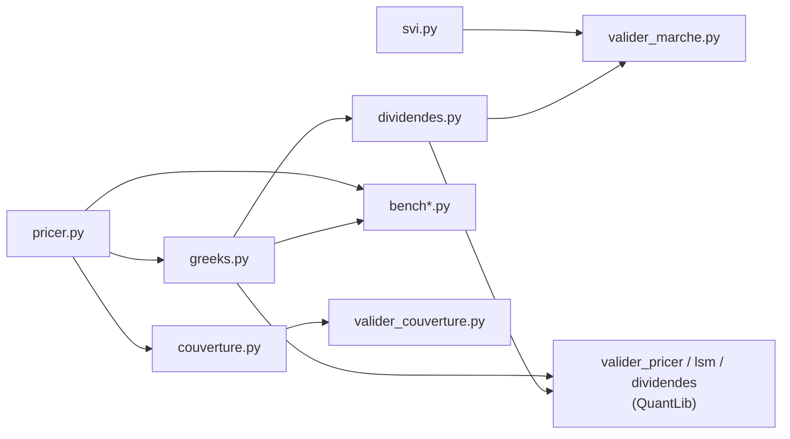

# options-pricing

**Pricing, Grecques et couverture d'options en Python, optimisés CPU et validés contre QuantLib et le marché.**

Options européennes, asiatiques et américaines (avec dividendes discrets) : formules
fermées, Monte Carlo avec réduction de variance, quasi-Monte Carlo, Longstaff–Schwartz
et arbre binomial. Calibration d'un smile SVI sans arbitrage sur de vraies chaînes
d'options, et backtest de stratégies de couverture. Code vectorisé avec NumPy,
compilé et parallélisé avec Numba.

Les méthodes numériques suivent G. Pagès, *Numerical Probability* (Springer, 2018) ;
la partie couverture suit Bouchard & Chassagneux, *Fundamentals and Advanced
Techniques in Derivatives Hedging* (Springer, 2016).


---

## Sommaire

- [En bref](#en-bref)
- [Fonctionnalités](#fonctionnalités)
- [Résultats](#résultats)
- [Structure du projet](#structure-du-projet)
- [Installation](#installation)
- [Démarrage rapide](#démarrage-rapide)
- [Méthodes numériques](#méthodes-numériques)
- [Tests](#tests)
- [Validation externe](#validation-externe)
- [Limites connues](#limites-connues)
- [Références](#références)

---

## En bref

| | |
|---|---|
| Call européen, quasi-Monte Carlo | 10,45055 ± 0,00006 pour une valeur exacte de 10,45058 |
| Prix + 5 Grecques en **une seule** simulation | 2 M de trajectoires, écart à la formule exacte < 0,1 % |
| Chaîne d'options synthétique pricée par QuantLib | **100 %** des options repricées dans la fourchette bid-ask |
| Couverture, vol réalisée inconnue entre 15 % et 25 % | écart-type du P&L divisé par 8 (17 % → 2 % de la prime) avec une couverture gamma-neutre |
| Suite de tests | 233 tests pytest, dont des tests de propriétés avec Hypothesis |

---

## Fonctionnalités

| Option | Prix | Grecques (Δ, Γ, Véga, ρ, Θ) |
|---|---|---|
| **Européenne** | Formule fermée, Monte Carlo (antithétique + variable de contrôle), quasi-Monte Carlo (Sobol brouillé) | Formules fermées ; Monte Carlo pathwise et rapport de vraisemblance |
| **Asiatique arithmétique** | Monte Carlo Numba + variable de contrôle géométrique | Pathwise / rapport de vraisemblance, avec variable de contrôle |
| **Asiatique géométrique** | Formule fermée | Dérivées de la formule fermée |
| **Américaine** | Longstaff–Schwartz (Numba), arbre binomial CRR | Arbre CRR ; différences finies à nombres aléatoires communs |
| **Américaine avec dividendes discrets** | Arbre CRR, modèles « spot » et « escrowed » | Arbre CRR |

Et aussi :

- **Intervalle de confiance à 95 %** sur chaque estimation Monte Carlo (`MCResult`).
- **Smile de volatilité SVI** (Gatheral) avec contrôles d'absence d'arbitrage :
  papillon (condition de Durrleman), calendaire, borne de Roger Lee sur les ailes.
- **Validation sur données de marché** : nettoyage des cotations, calage d'un coût
  d'emprunt implicite par échéance, inversion des vols implicites, repricing dans la
  fourchette bid-ask.
- **Backtest de couverture** : delta-hedging discret, vol mal spécifiée, vol incertaine
  (Black–Scholes–Barenblatt), couverture gamma-neutre, CVaR du P&L.

---

## Résultats

Mesures sur un call S = K = 100, r = 5 %, σ = 20 %, T = 1 an (Linux, 2 cœurs). Les temps
sont indicatifs : relancez `bench.py` et `bench_greeks.py` sur votre machine.

### Réduction de variance

L'erreur Monte Carlo décroît en σ/√N : diviser l'écart-type par 10 revient à diviser
par 100 le nombre de simulations nécessaires.

| Méthode (≈ 2 M de tirages) | Temps | Prix ± demi-largeur IC 95 % |
|---|---|---|
| Monte Carlo brut | 0,064 s | 10,4556 ± 0,0204 |
| + antithétique + variable de contrôle | 0,047 s | 10,4480 ± 0,0038 |
| Quasi-Monte Carlo (Sobol brouillé) | 0,091 s | **10,45055 ± 0,00006** |
| *Formule fermée* | | *10,45058* |

Pour l'asiatique arithmétique (52 dates), la variable de contrôle géométrique réduit
l'intervalle de confiance d'un facteur 36 (± 0,022 → ± 0,0006) à temps de calcul égal.

### Grecques Monte Carlo contre formules exactes

Une seule simulation donne le prix **et** les 5 Grecques (2 M de trajectoires) :

| Grecque | Monte Carlo ± IC 95 % | Exact |
|---|---|---|
| Delta | 0,63697 ± 0,00028 | 0,63683 |
| Gamma | 0,01874 ± 0,00005 | 0,01876 |
| Véga | 37,486 ± 0,091 | 37,524 |
| Rho | 53,251 ± 0,030 | 53,232 |
| Thêta (par an) | −6,411 ± 0,009 | −6,414 |

### Put américain

| Méthode | Prix |
|---|---|
| Longstaff–Schwartz, 200 000 trajectoires × 50 dates | 6,0803 ± 0,0316 |
| Arbre CRR, 2 000 pas | 6,0900 |
| *Put européen (borne basse)* | *5,5735* |

### Smile de volatilité sur données de marché

`valider_marche.py` inverse le pricer américain (dividendes discrets) sur chaque
cotation, cale un smile SVI par échéance et mesure la part des options repricées dans
la fourchette bid-ask.

- **Chaîne synthétique** pricée par QuantLib (moteur indépendant), 6 échéances de 17 à
  290 jours : **100 %** des 322 options retenues repricées dans la fourchette, écart
  médian smile − marché de 0,04 point de vol, coût d'emprunt retrouvé (0,30 % visé,
  0,21 % à 0,39 % calé selon l'échéance), aucun arbitrage papillon ni calendaire.
- **Chaîne AAPL réelle** (Yahoo Finance, 6 octobre 2026) : environ 89 % des options
  repricées dans la fourchette.



### Couverture

Call ATM 6 mois vendu au prix Black–Scholes à 20 %, delta-hedgé 52 fois. La vol réalisée
est inconnue, tirée uniformément entre 15 % et 25 % sur chaque trajectoire
(100 000 trajectoires) :

| Stratégie | P&L moyen | Écart-type du P&L | CVaR 5 % |
|---|---|---|---|
| Delta seul | +0,004 ± 0,010 | 1,091 (**17,1 %** de la prime) | −2,57 |
| Delta + gamma-neutre (seconde option) | +0,000 ± 0,001 | 0,136 (**2,1 %** de la prime) | −0,29 |

Le script vérifie aussi la théorie point par point : P&L moyen nul sous le bon modèle,
écart-type en 1/√N (pente log-log mesurée −0,49, écart de 1 à 4 % avec le premier ordre
théorique), formule ½ ∫ e^{−rt}(σ̃² − σ²) S² Γ dt pour une vol mal spécifiée, et
couverture à σ_max qui ne perd jamais en moyenne quand la vol est incertaine.



---

## Structure du projet

```
options-pricing/
├── pricer.py               Prix : Black–Scholes, MC, QMC, asiatique, américaine (LSM)
├── greeks.py               Grecques : formules fermées, pathwise, LR, différences finies, CRR
├── dividendes.py           Arbre CRR américain avec dividendes discrets (spot / escrowed)
├── svi.py                  Smile SVI : calage, contrôles d'arbitrage papillon et calendaire
├── couverture.py           Backtest de couverture : delta-hedging, gamma-neutre, P&L
├── bench.py                Benchmark des prix
├── bench_greeks.py         Benchmark des Grecques
├── valider_pricer.py       crr_american vs QuantLib, propriétés théoriques
├── adaptateur_crr.py       Adaptateur de crr_american pour valider_pricer.py
├── valider_lsm.py          Longstaff–Schwartz vs QuantLib
├── valider_dividendes.py   crr_american_div vs QuantLib
├── valider_marche.py       Test sur une vraie chaîne d'options (Yahoo Finance ou CSV)
├── valider_couverture.py   Validation du backtest de couverture contre la théorie
├── generer_chaine_test.py  Chaîne synthétique (QuantLib) pour tester hors ligne
├── docs/                   Graphiques du README
├── pyproject.toml          Configuration du projet et de pytest
└── tests/
    ├── conftest.py
    ├── test_closed_form.py     Formules fermées, parités, EDP de Black–Scholes
    ├── test_monte_carlo.py     Estimateurs MC, réduction de variance, LSM
    ├── test_greeks_mc.py       Grecques MC, différences finies, arbre CRR
    ├── test_proprietes.py      Propriétés d'arbitrage et cohérence entre méthodes
    ├── test_dividendes.py      Arbre avec dividendes discrets vs QuantLib
    ├── test_svi.py             Calage SVI et contrôles d'arbitrage
    └── test_valider_marche.py  Mesure du temps, calage du borrow, vols implicites
```



---

## Installation

Python 3.10 ou plus récent.

```bash
git clone https://github.com/matthieu-briche/options-pricing.git
cd options-pricing
python -m pip install numpy scipy numba pytest pytest-cov hypothesis
```

Pour la validation externe (facultatif) :

```bash
python -m pip install QuantLib pandas matplotlib yfinance
```

---

## Démarrage rapide

### Prix

```python
from pricer import BlackScholes, bs_price, mc_european, rqmc_european, mc_asian_arithmetic, lsm_american_put

m = BlackScholes(s0=100, r=0.05, sigma=0.2)      # dividende continu q = 0 par défaut

print(bs_price(m, K=100, T=1))                   # 10.4506  (formule fermée)
print(mc_european(m, K=100, T=1))                # 10.447964 ± 0.003823  (IC95 [...], N=2,000,000)
print(rqmc_european(m, K=100, T=1))              # 10.450554 ± 0.000055
print(mc_asian_arithmetic(m, K=100, T=1, n_steps=52))
print(lsm_american_put(m, K=100, T=1))           # 6.080280 ± 0.031559
```

`bs_price` est vectorisé : on peut passer un tableau de strikes ou de maturités.

### Grecques

```python
from greeks import bs_greeks, mc_european_greeks, crr_american

exact = bs_greeks(m, K=100, T=1)                 # formules fermées
mc    = mc_european_greeks(m, K=100, T=1)        # prix + 5 Grecques, avec IC
print(mc["delta"])                               # 0.636969 ± 0.000282
amer  = crr_american(m, K=100, T=1, kind="put")  # américaine, arbre CRR
```

### Américaine avec dividendes discrets

```python
from dividendes import crr_american_div

divs = [(0.25, 1.5), (0.50, 1.5), (0.75, 1.5)]   # (date en années, montant)
print(crr_american_div(m, K=100, T=1, kind="put", dividends=divs, model="escrowed"))
```

### Couverture

```python
import numpy as np
from pricer import BlackScholes
from couverture import simuler_couverture, OptionCouverture

m = BlackScholes(s0=100, r=0.03, sigma=0.20)                 # vol de couverture
sigma_reelle = np.random.default_rng(0).uniform(0.15, 0.25, 100_000)

delta  = simuler_couverture(m, K=100, T=0.5, n_reb=52, sigma_reelle=sigma_reelle)
gamma0 = simuler_couverture(m, K=100, T=0.5, n_reb=52, sigma_reelle=sigma_reelle,
                            couverture_gamma=OptionCouverture(K=100, T=1.0))
print(delta.resume()["ecart_type_rel"], gamma0.resume()["ecart_type_rel"])   # ≈ 0.17  0.02
```

---

## Méthodes numériques

| Méthode | Fonction | Pagès, chapitre |
|---|---|---|
| Simulation exacte de S_T (sans biais de discrétisation) | `mc_european` | 2 |
| Intervalle de confiance, erreur standard en ligne par blocs | `MCResult`, `_RunningStats` | 2.1 |
| Variables antithétiques | `mc_european`, `mc_european_greeks` | 3.1.2 |
| Variable de contrôle à β optimal | `mc_european`, `mc_asian_arithmetic`, `mc_asian_greeks` | 3.2 |
| Quasi-Monte Carlo randomisé (Sobol brouillé) | `rqmc_european` | 4.4 |
| Grecques pathwise (processus tangent) | `mc_european_greeks`, `mc_asian_greeks` | 2.2.4, 10 |
| Gamma : estimateur mixte pathwise / rapport de vraisemblance | idem | 2.2.3, 10 |
| Différences finies à nombres aléatoires communs | `fd_greeks_crn` | 10 |
| Longstaff–Schwartz (régression polynomiale) | `lsm_american_put` | 12 |
| Arbre binomial de Cox–Ross–Rubinstein | `crr_american`, `crr_american_div` | 12 |

**Pourquoi un estimateur mixte pour le Gamma ?** Le Delta pathwise d'un call,
e^{−rT} 1{S_T > K} S_T / S_0, est discontinu en K : on ne peut pas le dériver une
seconde fois trajectoire par trajectoire. On applique donc le rapport de
vraisemblance au Delta pathwise, ce qui revient à le pondérer par Z/(σ√T) − 1.

**Pourquoi des nombres aléatoires communs ?** Une différence finie
(V(S+h) − V(S−h)) / 2h calculée avec deux simulations indépendantes est noyée dans le
bruit Monte Carlo. Avec la même graine pour les deux prix, le bruit se compense.

**Pourquoi SVI plutôt qu'un polynôme ?** Ailes linéaires en variance (conformes au
théorème de Roger Lee), extrapolation saine hors des strikes cotés, paramètres
interprétables et conditions d'absence d'arbitrage vérifiables.

### Optimisation CPU

| Technique | Effet |
|---|---|
| Réduction de variance | jusqu'à ×36 sur l'intervalle de confiance à temps égal |
| Une simulation pour le prix et les 5 Grecques | évite les re-calculs de prix par différences finies |
| Vectorisation NumPy | aucune boucle Python sur les trajectoires |
| Noyaux Numba `@njit(parallel=True)` | asiatique, Grecques asiatiques, LSM en code machine multi-cœur |
| Calcul par blocs + statistiques en ligne | mémoire bornée, données dans le cache CPU |
| Générateur PCG64 + `SeedSequence` | résultats reproductibles |

Le premier appel d'une fonction Numba la compile (quelques secondes) ; le code compilé
est ensuite mis en cache sur disque.

---

## Tests

```bash
python -m pytest                   # 233 tests (≈ 1 min)
python -m pytest -m "not slow"     # 220 tests, sans les Monte Carlo lourds
```

| Fichier | Tests | Ce qui est vérifié |
|---|---|---|
| `test_closed_form.py` | 42 | Valeurs de référence, parité call-put, bornes d'arbitrage, EDP de Black–Scholes (Θ + ½σ²S²Γ + (r−q)SΔ − rV = 0) |
| `test_monte_carlo.py` | 31 | Absence de biais, erreur en 1/√N, couverture réelle de l'IC à 95 %, reproductibilité |
| `test_greeks_mc.py` | 43 | Chaque estimateur MC contre la formule exacte, différences finies, arbre CRR |
| `test_proprietes.py` | 59 | Propriétés vraies pour tout jeu de paramètres (Hypothesis) : monotonies, convexité en strike, encadrements, convergence de l'arbre |
| `test_dividendes.py` | 13 | Arbre avec dividendes discrets contre des valeurs de référence QuantLib |
| `test_svi.py` | 18 | Calage SVI, conditions de papillon et calendaire |
| `test_valider_marche.py` | 27 | Mesure du temps (fuseau, ACT/365), calage du borrow, inversion des vols |

Les tests Monte Carlo utilisent des **graines fixes** : une estimation est acceptée si
l'écart à la référence est inférieur à 4 erreurs standard.

---

## Validation externe

```bash
python valider_pricer.py --module adaptateur_crr     # arbre CRR vs QuantLib
python valider_lsm.py                                # Longstaff–Schwartz vs QuantLib
python valider_dividendes.py                         # dividendes discrets vs QuantLib
python valider_couverture.py                         # couverture vs théorie (≈ 20 s)

# Chaîne réelle (Yahoo Finance, données différées)
python valider_marche.py --ticker AAPL --taux 0.04   # taux sans risque du jour à renseigner

# Hors ligne : chaîne synthétique pricée par QuantLib
python generer_chaine_test.py
python valider_marche.py --chaine chaine_test.csv --dividendes dividendes_test.csv \
                         --spot 227.5 --date 2026-10-06 --taux 0.04
```

Les fichiers produits (`rapport_*.csv`, `resultats_marche_*.csv`, `smiles_*.png`…) sont
régénérables et ne sont pas versionnés.

---

## Limites connues

- **Pricer Black–Scholes** : volatilité et taux constants. Le smile SVI sert à la
  validation de marché (vol implicite par strike), pas de volatilité locale ou
  stochastique dans le pricer.
- **Longstaff–Schwartz** donne une borne **inférieure** du prix (politique d'exercice
  estimée) ; pour l'américaine vanille, l'arbre CRR est plus précis.
- **Mesure du temps** de `valider_marche.py` : ACT/365 à la seconde, sans calendrier
  de bourse (week-ends, jours fériés) ; options sur indices réglées le matin hors périmètre.
- **Couverture** : sans coûts de transaction ni impact de marché.

---

## Références

- G. Pagès, *Numerical Probability: An Introduction with Applications to Finance*,
  Universitext, Springer, 2018.
- B. Bouchard, J.-F. Chassagneux, *Fundamentals and Advanced Techniques in Derivatives
  Hedging*, Universitext, Springer, 2016.
- J. Gatheral, « A parsimonious arbitrage-free implied volatility parameterization »,
  Global Derivatives, 2004.
- R. Lee, « The Moment Formula for Implied Volatility at Extreme Strikes »,
  *Mathematical Finance*, 14(3), 2004.
- F. Longstaff, E. Schwartz, « Valuing American Options by Simulation: A Simple
  Least-Squares Approach », *Review of Financial Studies*, 14(1), 2001.
- J. Cox, S. Ross, M. Rubinstein, « Option Pricing: A Simplified Approach »,
  *Journal of Financial Economics*, 7(3), 1979.
- P. Glasserman, *Monte Carlo Methods in Financial Engineering*, Springer, 2003.

---

## Auteur

Matthieu Briche · [LinkedIn](https://www.linkedin.com/in/matthieu-briche-aa69b441/)
